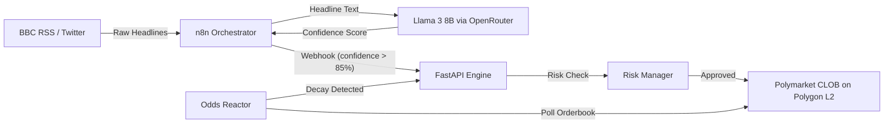

# Orderflow 001 – The Alpha Feed


**Track:** AI-Augmented Systems  
**Hackathon:** [Orderflow 001 – On-Chain Trading Systems Sprint](https://devpost.com)  

> An ultra-low-latency, AI-augmented news arbitrage engine built for prediction markets (Polymarket). It autonomously scans breaking global news, uses LLM inference to score geopolitical probability impact, and routes high-confidence signals to a Python execution engine to front-run the market.

---

## Demo Video
> *(Link your YouTube or Loom video here before submitting on Devpost!)*

[**Watch The Alpha Feed Demo**](https://youtube.com)

---

## Strategy Logic

The edge hypothesis relies on **information arbitrage**. Human traders on prediction markets often have a latency of minutes to hours when pricing in breaking news events (elections, rate hikes, geopolitical conflicts).

The Alpha Feed automates this on two fronts:

1. **News Arbitrage** – Ingests raw news via RSS/Twitter at millisecond latency. An LLM answers a binary question regarding global impact, triggering a fixed-size Kelly trade if confidence > 85.0%.
2. **Probability Decay Model** – A standalone reactor polls Polymarket's L2 Orderbook, calculating probability decay between ticks. If a market's "YES" shares crash aggressively (> 5% drop in 10s), the engine buys the dip to capture spread bounces.

---

## Architecture



| Component | Technology | Latency |
| :--- | :--- | :--- |
| News Ingestion to LLM Inference | n8n + OpenRouter | ~450ms |
| LLM Output to n8n Filtering | n8n IF Node | ~12ms |
| Webhook to Risk Evaluation | FastAPI + Pydantic | ~20ms |
| **Total Pipeline** | **End-to-End** | **< 500ms** |

---

## Project Structure

```
orderflow/
├── engine/                      # Python execution engine
│   ├── main.py                  # FastAPI server & webhook endpoint
│   ├── config.py                # Environment variable loading
│   ├── schemas.py               # Pydantic request/response models
│   ├── risk_manager.py          # Kelly Criterion risk evaluation
│   ├── polymarket_client.py     # Polymarket CLOB API wrapper
│   ├── odds_reactor.py          # Live probability decay model
│   ├── test_main.py             # Unit tests (5/5 passing)
│   └── requirements.txt
├── n8n/                         # n8n workflow files
│   └── README.md                # Workflow import instructions
├── docs/
│   ├── API.md                   # Full API reference
│   ├── QA_REPORT.md             # QA & testing report
│   ├── DEPLOYMENT.md            # Local deployment guide
│   └── HACKATHON_QA.md          # Hackathon FAQ
├── .env.example                 # Environment variable template
├── render.yaml                  # Render.com deployment config
├── demo_script.md               # 2-min demo voiceover script
├── CONTRIBUTING.md              # Contribution guide
├── LICENSE                      # MIT License
└── README.md
```

---

## Data Sources

| Source | Purpose |
| :--- | :--- |
| [BBC World News RSS](http://feeds.bbci.co.uk/news/world/rss.xml) | Primary breaking news feed |
| [Meta Llama 3 8B-Instruct](https://openrouter.ai) | LLM inference via OpenRouter API |
| [Polymarket CLOB API](https://docs.polymarket.com) | Order execution on Polygon L2 |

---

## Performance Metrics and Measurable Output

**Risk Management Constraints:**

| Parameter | Value |
| :--- | :--- |
| MAX_ORDER_SIZE_USDC | Hard-capped at 50 USDC per signal |
| MIN_CONFIDENCE_THRESHOLD | Must exceed 85.0% |
| Dynamic Sizing | Simplified Kelly Criterion (80-100% range) |
| Exchange Minimum | 5.0 USDC floor |

---

## Quick Start

### 1. Install the Execution Engine
```bash
cd engine
python -m venv venv
# Windows: venv\Scripts\activate
# Mac/Linux: source venv/bin/activate
pip install -r requirements.txt
```

### 2. Configure Environment Variables
```bash
cp .env.example .env
# Fill in your API keys
```

### 3. Run the Backend Webhook Engine
```bash
python main.py
```

### 4. Run the Live Odds Reactor (Probability Decay Model)
```bash
python odds_reactor.py
```

### 5. Import the n8n Workflow
See [n8n/README.md](n8n/README.md) for full setup instructions.

---

## Testing

```bash
cd engine
pytest test_main.py -v
```

All 5 tests cover: health checks, webhook authentication, valid trade execution, and confidence threshold rejection. See [docs/QA_REPORT.md](docs/QA_REPORT.md) for the full QA report.

---

## Documentation

| Document | Description |
| :--- | :--- |
| [docs/API.md](docs/API.md) | Full API endpoint reference |
| [docs/QA_REPORT.md](docs/QA_REPORT.md) | Quality assurance and testing report |
| [docs/DEPLOYMENT.md](docs/DEPLOYMENT.md) | Local deployment guide (ngrok + n8n) |
| [CONTRIBUTING.md](CONTRIBUTING.md) | How to contribute |

---

## License

This project is licensed under the [MIT License](LICENSE).
